#  Frontend APP Top Tenis Valencia  

<details>
  <summary>Contenido 📝</summary>
  <ol>
    <li><a href="#objetivo-🎯">Objetivo</a></li>
    <li><a href="#sobre-el-proyecto-🔎">Sobre el proyecto</a></li>
    <li><a href="#deploy-🚀">Deploy</a></li>
    <li><a href="#stack">Stack</a></li>
    <li><a href="#instalación-en-local">Instalación</a></li>
    <li><a href="#agiles">Metodologías ágiles</a></li>
    <li><a href="#vistas">Vistas</a></li>
    <li><a href="#futuras-funcionalidades">Futuras funcionalidades</a></li>
    <li><a href="#contribuciones">Contribuciones</a></li>
    <li><a href="#licencia">Licencia</a></li>
    <li><a href="#webgrafia">Webgrafia</a></li>
    <li><a href="#errores">Errores conocidos</a></li>
    <li><a href="#agradecimientos">Agradecimientos</a></li>
    <li><a href="#contacto">Contacto</a></li>
  </ol>
</details>

## Objetivo 🎯
Este proyecto requería conexión a una API funcional ya realizada en mi proyecto anterior en laravel, usar react con react-router-dom para el enrutado de la aplicación, hooks useState y useEffect para el control del estado de los componentes, redux con persist para el almacenamiento de algunos valores en un estado general de la aplicación, JavaScript ES6 con uso de funcionalidad asincrona async/await, y estilos CSS y bootstrap.

## Sobre el proyecto 🔎
La idea principal era crear una aplicación web de gestión de torneos de tenis para jugadores aficionados de una provincia, donde cada participante juega un partido semanal contra un rival asignado en modo liga todos contra todos.
Aunque la app también podría aplicarse para polideportivos municipales, o clubes de tenis donde se realizan torneos internos para sus socios. 
Las principales caracteristicas de esta aplicación son:
- Usuario administrador, se encargará de crear los torneos y realizar los emparejamientos de los jugadores.
También podrá realizar otras funciones como visualizar la información de todos los usuarios registrados en la aplicación, eliminar partidos y torneos.
- Usuario participante, mediante su registro a la aplicación y posterior login, podrá inscribirse a los torneos disponibles, ver el calendario de partidos asignados, añadir el resultado de sus partidos, ver los resultados y clasificación del torneo.
- Usuario sin registro, podrá entrar a home donde se explica el funcionamiento de la aplicación, listar los torneos de la aplicación y por supuesto realizar el registro para conseguir el acceso a un usuario participante.
  
## Deploy 🚀
<div align="center">
    <a href="https://frontend-react-top-tenis-valencia.vercel.app"><strong>Url a producción </strong></a>🚀🚀🚀
</div>

## Stack
<div align="center">
<a href="https://www.reactjs.com/">
    
</a>
<a href="https://developer.mozilla.org/es/docs/Web/JavaScript">
    
</a>
<a href="https://developer.mozilla.org/es/docs/Web/HTML">
    
</a>
<a href="https://developer.mozilla.org/es/docs/Web/CSS">
    
</a>
<a href="https://www.github.com/">
    
</a>
<a href="https://nodejs.org/">
    
</a>
<a href="https://jwt.io/">
    
</a>


 </div>

## Instalación en local
1. Clonar el repositorio
2. ` $ npm install `
3. ``` $ npm run dev ```

## Metodologias ágiles
<div align="center">
    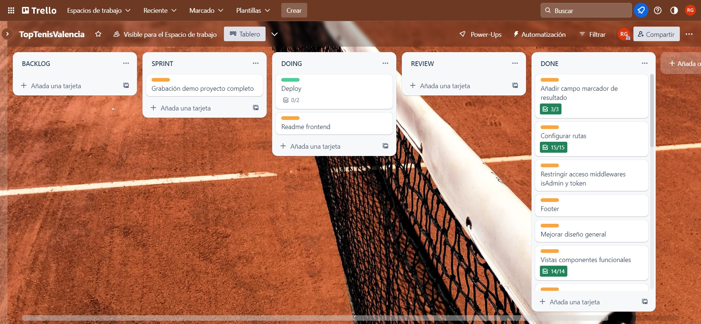
</div>

## Vistas
Home
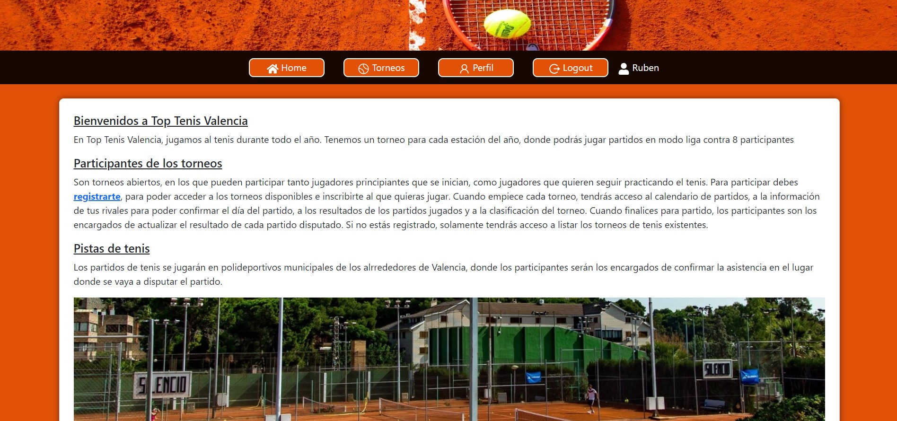  
Register
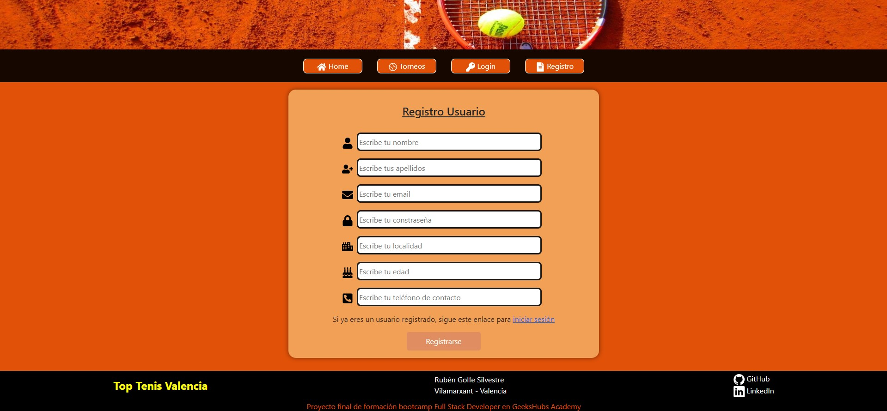
Login
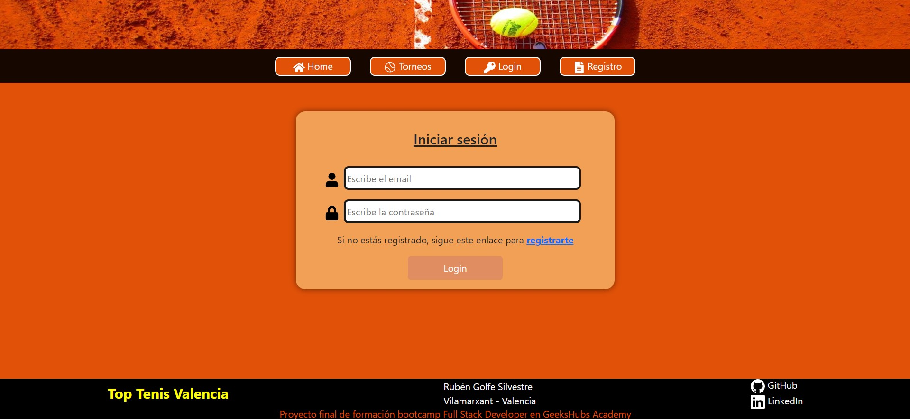
Profile
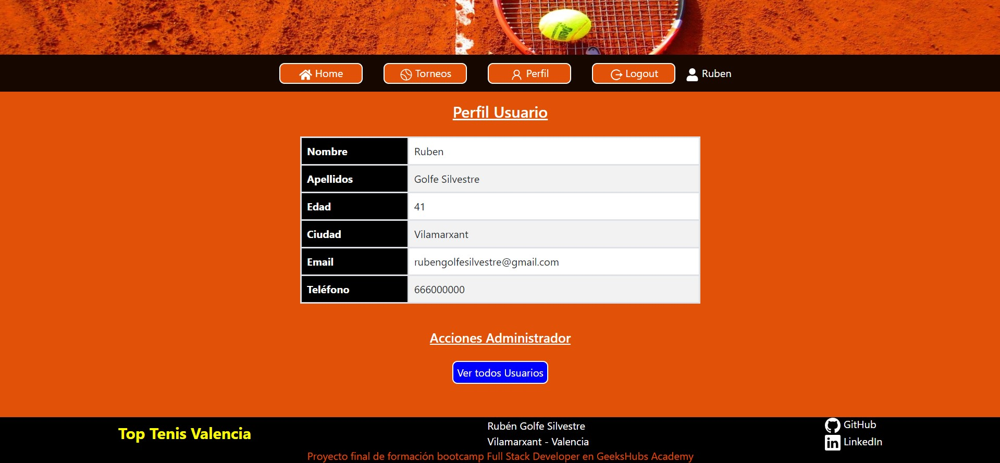
Listado Torneos
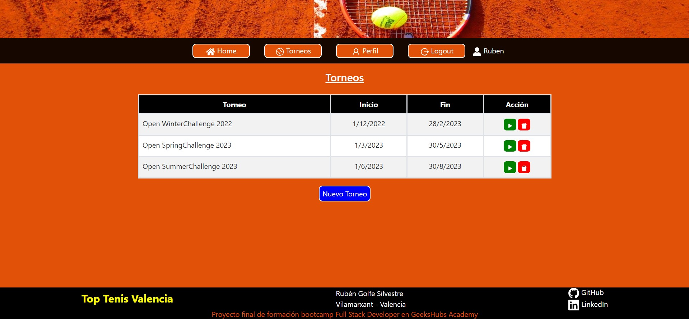
Menú Torneos
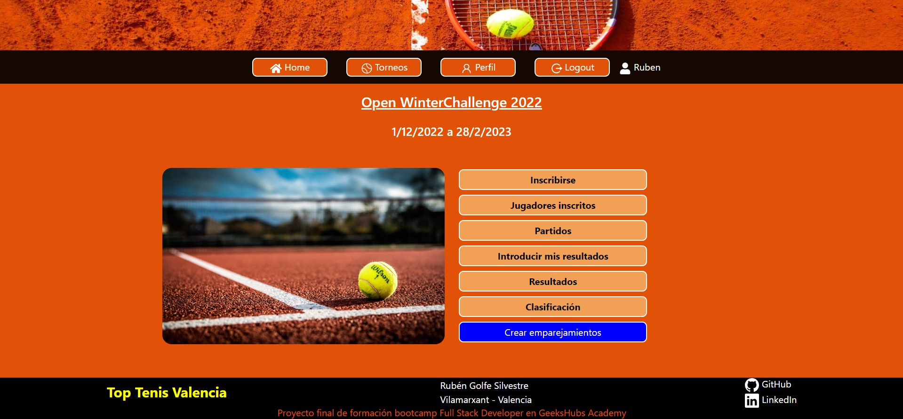
Emparejamientos
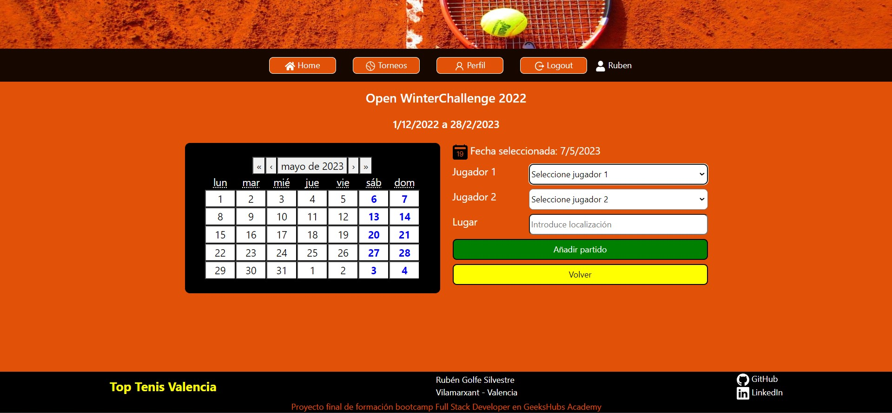
Partidos
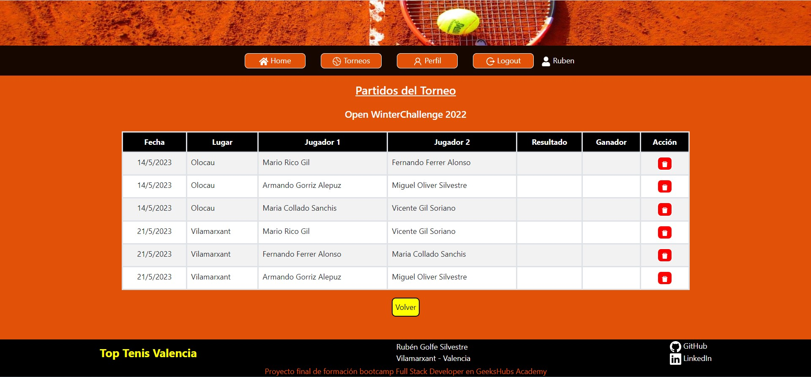
Actualizar resultado
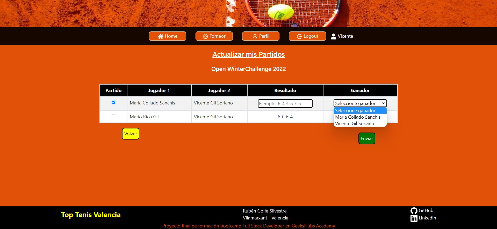
Resultados partidos finalizados
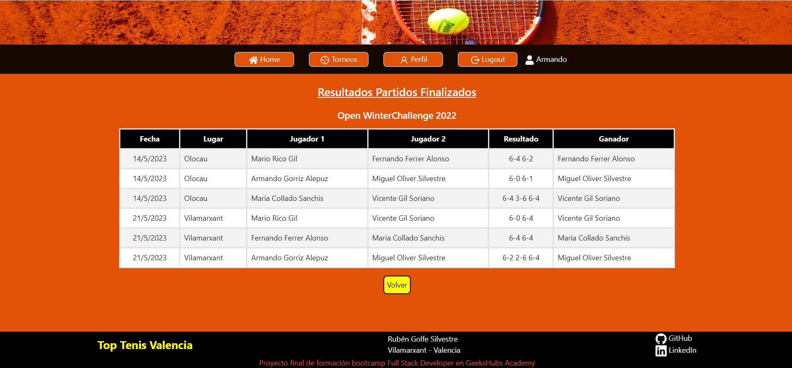
Clasificación
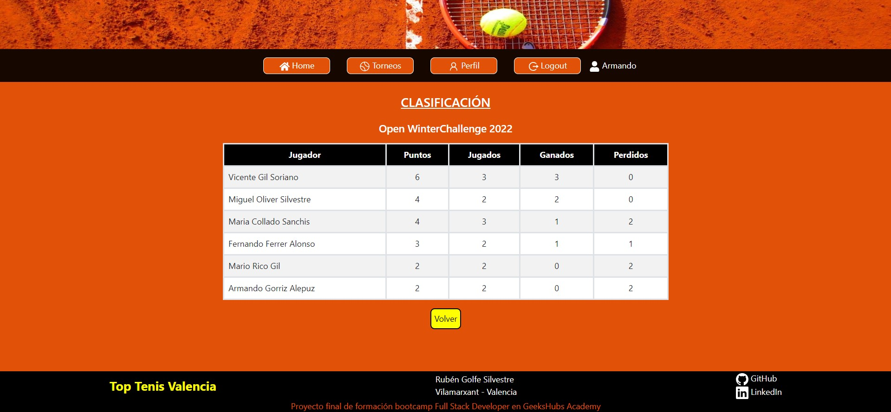


## Futuras funcionalidades  
⬜ Generar emparejamientos automáticamente  
⬜ Modificar datos de perfil del usuario

## Contribuciones
Las sugerencias y aportaciones son siempre bienvenidas.  

Puedes hacerlo de dos maneras:

1. Abriendo una issue
2. Crea un fork del repositorio
    - Crea una nueva rama  
        ```
        $ git checkout -b feature/nombreUsuario-mejora
        ```
    - Haz un commit con tus cambios 
        ```
        $ git commit -m 'feat: mejora X cosa'
        ```
    - Haz push a la rama 
        ```
        $ git push origin feature/nombreUsuario-mejora
        ```
    - Abre una solicitud de Pull Request

## Licencia
Este proyecto se encuentra bajo licencia MIT

## Webgrafia:
Para conseguir mi objetivo he recopilado información de:
- documentación interna de la formación en GeeksHubs Academy 

## Errores conocidos:
- La puntuación de la clasificación, no aumenta correctamente los puntos cuando el ganador es el jugador1
- La puntuación de la clasificación, se descuadra al modificar un resultado de un partido ya guardado anteriormente 
  
## Agradecimientos:

Agradezco a mis formadores el tiempo dedicado a orientarme en este proyecto:

- **David Ochando**  
<a href="https://www.linkedin.com/in/david-ochando-blasco-90b2ba1a/"></a>

- **Dani Tarazona**  
<a href="https://www.linkedin.com/in/daniel-tarazona-tamarit-05634794/"></a> 

## Contacto

Rubén Golfe Silvestre


<a href = "mailto:rgolfe81@gmail.com"></a>
<a href="https://www.linkedin.com/in/ruben-golfe/" target="_blank"></a> 
